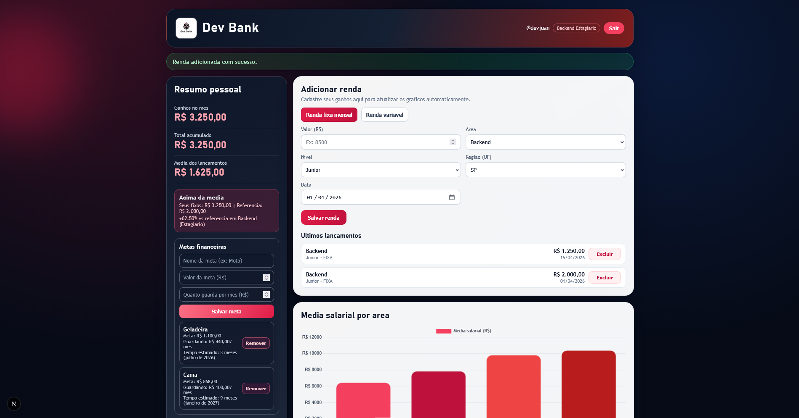

# DevRank - Gerenciamento de Rendas para Desenvolvedores



DevRank é uma aplicação web para gerenciamento e análise de rendas de desenvolvedores. Permite cadastrar ganhos, visualizar estatísticas salariais por área, nível e região, e comparar salários com outros usuários.

O projeto foi pensado para rodar localmente ou em containers, com foco em análise de dados salariais no mercado de TI brasileiro.

## Sumário

1. [Funcionalidades](#funcionalidades)
2. [Arquitetura](#arquitetura)
3. [Requisitos](#requisitos)
4. [Instalação](#instalação)
5. [Configuração](#configuração)
6. [Como rodar](#como-rodar)
7. [Exemplos de Uso](#exemplos-de-uso)
8. [Troubleshooting](#troubleshooting)
9. [Observações Importantes](#observações-importantes)

## Funcionalidades

### Cadastro e Gerenciamento

- Cadastro de ganhos com detalhes: valor, tipo, área, nível, região e data.
- Edição e exclusão de lançamentos.
- Validação de dados com catálogo pré-definido (áreas, níveis, tipos de renda).

### Dashboard e Análises

- Resumo pessoal: ganhos no mês, total acumulado, média dos lançamentos.
- Estatísticas salariais: médias por área, nível e região.
- Comparação salarial com outros usuários.
- Gráficos interativos com Chart.js.

### Autenticação e Segurança

- Sistema de login e registro com JWT.
- Controle de acesso por usuário autenticado.

### Persistência

- Banco de dados PostgreSQL para armazenar usuários e ganhos.
- Consultas otimizadas com Spring Data JPA.

## Arquitetura

```text
DevRank/
  backend/                     # Servidor Spring Boot
    src/main/java/com/devrank/backend/
      controller/              # Endpoints REST (Auth, Income, Stats)
      service/                 # Lógica de negócio (AuthService, IncomeService, etc.)
      model/                   # Entidades JPA (User, Income)
      repository/              # Repositórios Spring Data
      security/                # Configuração JWT e segurança
      dto/                     # Objetos de transferência (Request/Response)
    src/main/resources/
      application.properties   # Configurações do app
  frontend/                    # Cliente Next.js
    src/app/                   # Páginas e componentes React
      page.tsx                 # Dashboard principal
      layout.tsx               # Layout global
    src/components/            # Componentes reutilizáveis
  docker-compose.yml           # Orquestração de containers
  backend/pom.xml              # Dependências Maven
  frontend/package.json        # Dependências Node.js
```

## Requisitos

- Windows/Linux/macOS (compatível com Docker).
- Docker e Docker Compose (para execução completa).
- Node.js 18+ e Java 17+ (para desenvolvimento local).
- PostgreSQL (via Docker ou local).
- Navegador web moderno.

## Instalação

### 1) Clonar o repositório

```bash
git clone https://github.com/JuanRoberto1212/DevRank
cd devrank
```

### 2) Instalar dependências

Para desenvolvimento local:

- **Backend**: Navegue para `backend/` e execute:
  ```bash
  ./mvnw dependency:resolve
  ```

- **Frontend**: Navegue para `frontend/` e execute:
  ```bash
  Copy-Item .env.example .env.local -Force
  npm.cmd install
  npm.cmd run dev
  ```

Para execução com Docker, as dependências são resolvidas automaticamente.

## Configuração

### 1) Arquivo de ambiente (opcional para desenvolvimento)

Para o backend, edite `backend/src/main/resources/application.properties`:

```properties
spring.datasource.url=jdbc:postgresql://localhost:5432/devrank
spring.datasource.username=devrank
spring.datasource.password=devrank123
spring.jpa.hibernate.ddl-auto=update
app.jwt.secret=sua-chave-jwt-aqui
```

Para o frontend, crie um `.env.local` se necessário (ex.: para APIs externas, mas não há no projeto atual).

### 2) Banco de dados

O Docker Compose configura o PostgreSQL automaticamente. Para local:

- Instale PostgreSQL.
- Crie banco `devrank` com usuário `devrank` e senha `devrank123`.

## Como rodar

### Com Docker Compose (recomendado)

```bash
docker compose up -d
```

Acesse em `http://localhost:3000`.

### Desenvolvimento local

1. **Backend**:
   ```bash
   cd backend
   ./mvnw spring-boot:run
   ```

2. **Frontend**:
   ```bash
   cd frontend
   npm run dev
   ```

Acesse o frontend em `http://localhost:3000` e backend em `http://localhost:8080`.

## Exemplos de Uso

- **Cadastrar ganho**: Preencha o formulário com valor, tipo (ex.: Salário), área (ex.: Backend), nível (ex.: Pleno), região (ex.: Sudeste) e data.
- **Visualizar estatísticas**: No dashboard, veja médias salariais por área e comparações.
- **Editar lançamento**: Clique em "Excluir" ao lado do item na lista (atualizar via API).

## Troubleshooting

### 1) "Erro de conexão com banco"

- Verifique se o PostgreSQL está rodando (via Docker ou local).
- Confirme as credenciais em `application.properties`.

### 2) Frontend não carrega

- Execute `npm install` novamente.
- Verifique se o backend está rodando em `http://localhost:8080`.

### 3) Erro de build no backend

- Execute `./mvnw clean compile`.
- Garanta Java 17+ instalado.

### 4) Containers não sobem

- Execute `docker compose down` e tente novamente.
- Verifique portas 3000, 8080 e 5432 livres.

### 5) Dados não aparecem

- Verifique logs do backend para erros de JWT ou autenticação.
- Certifique-se de estar logado.

## Observações Importantes

- O projeto usa `LocalDate` para datas, evitando problemas de timezone no backend.
- Dados são armazenados localmente no banco; backup recomendado.
- Para produção, configure variáveis de ambiente seguras (JWT secret, DB credentials).
- Contribuições são bem-vindas; abra issues ou PRs.

---

Se quiser evoluir o README com screenshots ou GIFs do dashboard, ficaria ainda melhor para novos usuários!